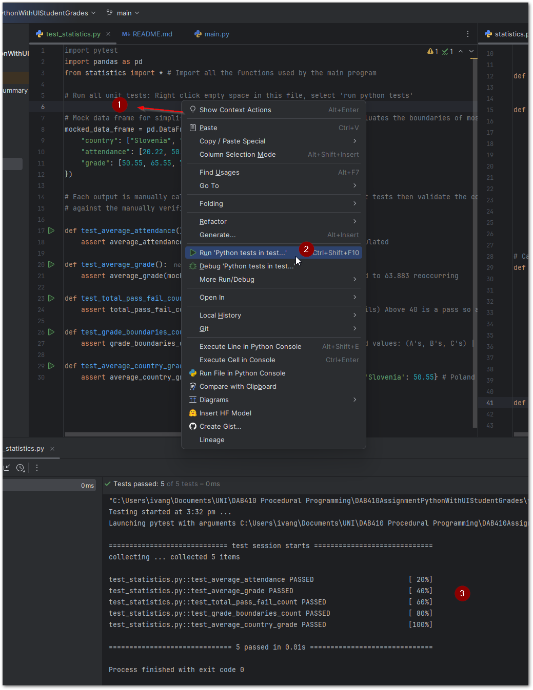

# Contents
### [Program Overview](#program_overview)
### [Program Features](#program_features)
#### [Menu](#1_menu)
#### [Search](#2_search)
#### [Stats Summary](#3_stats_summary)
#### [Results Table](#4_results_table)
#### [Student Image](#5_student_image)
#### [Generate Student Photo](#6_generate_student_photo)
#### [Student Summary Table](#7_student_summary_table)
#### [Student Summary Text](#8_student_summary_text)
### [Running Program](#9_running_program)
#### [Prerequisites](#prerequisites)
#### [Installing Python Packages](#installing_python_packages)
#### [Running Program](#running_program)
#### [Running Tests](#running_tests)

## #program_overview
This Python application provides a user interface for interpreting student data from a provided dataset `student_grades.csv` in the program root directory.  
A summary of overall student statistics is provided, in addition, a search feature allows individual students to be identified.

## #program_features


### #1_menu
The 'File' menu provides access to a bar chart. The information displayed is a collation of students by their country of birth and ranked by the top 10 with the highest average grade score.

### #2_search
The central results table updates dynamically as the user enters a query. Less relevant results are removed when the system is highly confident in the match accuracy (100% fuzzy search match).  
By default, searches are conducted on:
- student_id  
- first_name  
- last_name  
- email  
- country  

Checkbox filters allow users to exclude speciffic columns from the search criteria. For example, searching for 'China' can exclude email to prevent results appearing for:

Student: 959

Email: bghiraldimqm@**china**.com.cn

Country: Philippines


### #3_stats_summary
The left-hand pane lists an aggregated statistical summary of all imported student results.

### #4_results_table
Students can be selected by left-clicking the results table. The associated student is displayed in the 'Student Profile' pane. If multiple results are selected using SHIFT + Left Click, only the top result is displayed.

### #5_student_image
A placeholder image is displayed by default. When a student image is generated, it is saved to the `/StudentPhotos` folder under the student’s ID as a .jpg file.  
To remove student images, delete them from this folder while ensuring `placeholder.jpg` is not removed.

### #6_generate_student_photo
The dataset does not include student gender. Therefore, an API request is made to `api.genderize.io` using the student’s first name. If gender is not available, "all" is used.  

For example:

ID: 3

Name: Wandis
Is not recognised by the genderize.io api, despite returning a 200 (success) status code the gender field will return 'none' 

A second API request is made to `this-person-does-not-exist.com` with the predicted gender and age bracket. The generated image is saved in the studentPhotos folder previously mentioned.

### #7_student_summary_table
When selecting a student, their statistics appear in the right-hand pane. If values overflow their row, the application window can be resized for better viewing.

### #8_student_summary_text
The student’s grade is compared with their country's average grade, displaying the percentage increase or decrease in a text summary.  
Standard percentage calculation was referenced from: [skillsyouneed.com](https://www.skillsyouneed.com/num/percent-change.html).

## #9_running_program

### #prerequisites
- PyCharm IDE installed  
- Python 3.13 or greater (Download from [python.org](https://www.python.org/downloads/) or Microsoft Store)  
- Obtain program files: Download via Git clone or .zip from GitHub, then open the  
  `DAB410AssignmentPythonWithUIStudentGrades` folder in PyCharm.  

 

### #installing_python_packages
Packages can be installed in multiple ways:
- Open main.py, hover over missing imports, and use "Install package" from the context menu.


- OR run the following command for each missing package:
```
pip install package_name
```
Required packages:
- tkinter
- numpy
- pandas
- requests
- PIL (Also known as 'Pillow')
- thefuzz
- matplotlib
- pytest

## #running_program
Within pycharm the **main.py** module must be selected in addition to 'current file', then click run from the GUI.


## #running_tests
Unit tests are located in 'test_statistics.py' in this program's root directory. Loading via Pycharm, right-click blank space 
and select 'run python tests', a console output will display test results. 
Having a line of test code selected will run that specific test and not the whole test suite.
